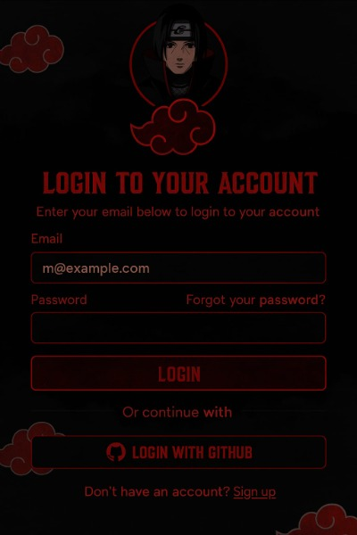

# Akatsuki Theme Login Creado Por Michael Felipe Corrales Florez


Un tema de login inspirado en Akatsuki (organización de Naruto), con un diseño oscuro y rojo característico de la organización. Este proyecto implementa una pantalla de inicio de sesión estilizada con elementos visuales distintivos como nubes rojas y un diseño minimalista pero impactante.



## Estructura del Proyecto

```
LoginTheme/
├── Fonts/
│   └── Bolton Serif Regular.{woff2,woff,ttf}
├── Recursos/
│   ├── cloud.png
│   ├── cloudnitgh.png
│   └── mc.jpg
├── AkatsukiThemeLogin.css
├── AkatsukiThemeLogin.html
└── AkatsukiThemeLogin.js
```

## Características

- Diseño responsive adaptado para móviles y escritorio
- Tema oscuro con detalles en rojo inspirados en Akatsuki
- Formulario de login con email y contraseña
- Opción de login con GitHub
- Imagen de perfil con borde rojo característico
- Animaciones y efectos hover en botones
- Tipografía personalizada "Bolton Serif Regular"
- Nubes rojas de Akatsuki como elementos decorativos

## Tecnologías Utilizadas

- HTML5
- CSS3 (con media queries para responsividad)
- JavaScript
- Fuentes web personalizadas

## Instalación

1. Clona este repositorio o descarga los archivos
2. Asegúrate de mantener la estructura de carpetas intacta
3. Abre el archivo `AkatsukiThemeLogin.html` en tu navegador

## Personalización

Puedes personalizar varios aspectos del tema:

- Cambia las imágenes en la carpeta `Recursos/`
- Modifica los colores en `AkatsukiThemeLogin.css` (El color principal es `#e4000f`)
- Ajusta el comportamiento en `AkatsukiThemeLogin.js`

## Vista Previa

La página de login presenta:
- Fondo negro
- Imagen de perfil circular con borde rojo
- Título "LOGIN TO YOUR ACCOUNT" en tipografía distintiva
- Campos para email y contraseña
- Opción para recuperar contraseña
- Botón de login principal
- Separador
- Botón alternativo para login con GitHub
- Enlace para registro de nuevos usuarios
- Nubes rojas características de Akatsuki como elementos decorativos

## Uso

Este tema puede ser implementado como:
- Página de inicio de sesión para sitios web de temática de anime
- Proyectos relacionados con Naruto
- Base para desarrollar interfaces con temática similar

## Créditos

Diseñado y desarrollado desde cero como un proyecto personal.

## Licencia

[icencia preferida]

⭐️ Desarrollado con pasión por Michael Felipe Corrales Flórez © 2025
